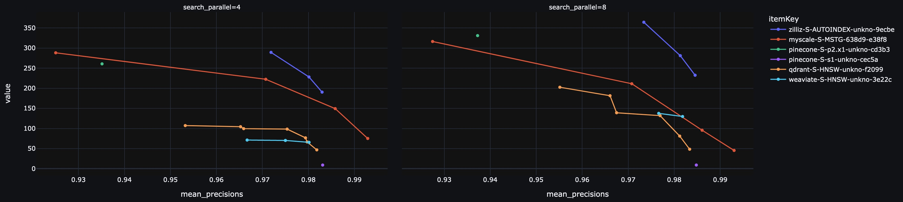
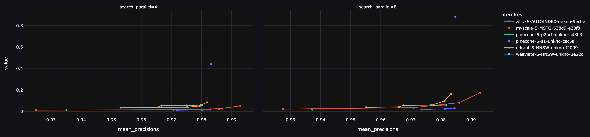
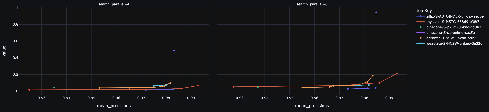
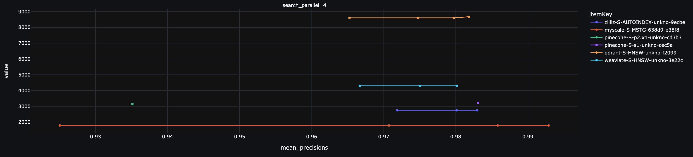

# vector-db-benchmark: a benchmark for vector databases

This benchmark tests typical workloads on cloud services for vector databases. It is a fork of [qdrant/vector-db-benchmark](https://github.com/qdrant/vector-db-benchmark/), and supports cloud services like MyScale, Pinecone, Weaviate Cloud, Qdrant Cloud, and Zilliz Cloud.

## Datasets

The datasets used include:

| Dataset name             | Description                                                                                                                               | Number of vectors | Number of queries | Dimension | Distance | Filters                             | Payload columns | Download link                                                                                     |
|--------------------------|-------------------------------------------------------------------------------------------------------------------------------------------|-------------------|-------------------|-----------|----------|-------------------------------------|-----------------|---------------------------------------------------------------------------------------------------|
| laion-768-5m-ip          | Provided by MyScale. Generated from [LAION 2B images](https://huggingface.co/datasets/laion/laion2b-multi-vit-h-14-embeddings/tree/main). | 5,000,000         | 10000             | 768       | IP       | N/A                                 | 0               | [link](https://myscale-datasets.s3.ap-southeast-1.amazonaws.com/laion-5m-test-ip.hdf5)            |

## Results

You can find the summary of benchmark results in our [blog post](https://blog.myscale.com/2023/05/17/myscale-outperform-special-vectordb/).  Here we present more detailed results.

For each vector database, we first uploaded the laion-768-5m-ip dataset and built vector indexes. Then we tested the throughput and latency of querying the top 10 closest neighbors.  We allocated the client in the same region as the cloud service to reduce the impact of networking.

The regions we used for each cloud service:

| Service | Server Region | Client Region |
|---|---|---|
| MyScale | AWS us-east-1 | AWS us-east-1 |
| Pinecone | AWS us-east-1 | AWS us-east-1 |
| Qdrant | AWS us-east-1 | AWS us-east-1 |
| Weaviate | GCP US East | AWS us-east-1 |
| Zilliz Cloud | AWS us-east-2 | AWS us-east-2 |

Here is the table showing the monthly cost and throughput of different vector databases with a 98.5% accuracy rate:

| Service | Throughput (QPS) | Monthly Cost ($) | Remark   |
| ------------- | ----- | ------------- | -------- |
| MyScale's standard pod (alpha=3)                | 150 | 120              | Beta with free trial, standard tier coming soon |
| Pinecone s1                         | 9   | 69               | GCP Base Price                                           |
| Qdrant 4c32g                        | 81  | 273              | HNSW m=32 ef_c=256                                                        |
| Weaviate                            | 66  | 690             | Total monthly queries calculated as 5 * 3600 * 24 * 30  |
| Zilliz Cloud 1CU Storage Optimized | 63  | 186              | -                                                        |
| Zilliz Cloud 4CU Performance Optimized | 232  | 746              | -                                                        |

Note that we tested the Pinecone p2 pod as well. However, Pinecone does not allow users to balance accuracy rate and throughput, and it can only achieve 93% accuracy. Therefore, we cannot compare Pinecone p2 with other competitors in the table above. The table below shows the monthly cost and throughput of MyScale and Pinecone with a 93% accuracy rate.

| Service | Throughput (QPS) | Monthly Cost ($) | Remark   |
| ------------- | ----- | ------------- | -------- |
| MyScale's standard pod (alpha=1)    | 288 | 120              | Beta with free trial, standard tier coming soon                                                        |
| Pinecone 5 p2.x1                     | 331 | 518              | Horizontal scaling of 5 p2 pods                                     |

Next, we will present detailed results on throughput, latency, and upload time in the following figures. We are also developing an interactive frontend for this benchmark that will allow you to view the results more conveniently. Please stay tuned for further updates!

Throughput (QPS):


Mean latency:


P95 Latency:


The total time for uploading data and building vector index:


## Run the Benchmark

You need to install the required libraries on the client used for benchmark.

```shell
pip install -r requirements.txt
```

Next, you can follow [Step-by-Step Guide for Benchmark](docs/step-by-step-guide-for-benchmark.md) to run benchmark for each cloud services.
