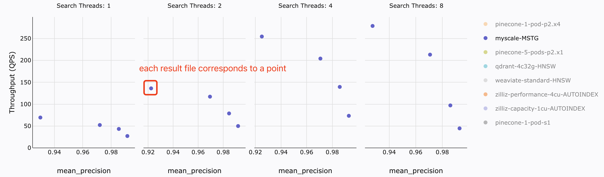

# Result Visualization
> Before proceeding with result visualization, you need to test and obtain some **result files** according to the process in [step-by-step-guide-for-benchmark.md](./step-by-step-guide-for-benchmark.md)
## Preparation
### Gather Test Results

### Clone Our Benchmark Repo
```shell
git clone git@github.com:myscale/benchmark.git
```

## Handle Test Results
### Step1. Update Monthly Cost
The test results do not include the price of the cluster you tested, so you need to manually add the monthly price to the test results.
You can modify the specific price information within the [script](../scripts/handle_price.py)
```shell
cd vector-db-benchmark/scripts
python3 handle_price.py
```
### Step2. Generate `benchmark.json`
```shell
cd vector-db-benchmark/scripts
python3 process_result_files.py
```
Then you will get a json file named `benchmark.json`, please replace [old_benchmark.json](https://github.com/myscale/benchmark/blob/main/public/benchmark.json) with your new `benchmark.json`.
## View Plotly Chart 
Please start your website according to the [readme](https://github.com/myscale/benchmark/blob/main/README.md), each result file corresponds one-to-one with a point in the scatter plot.

