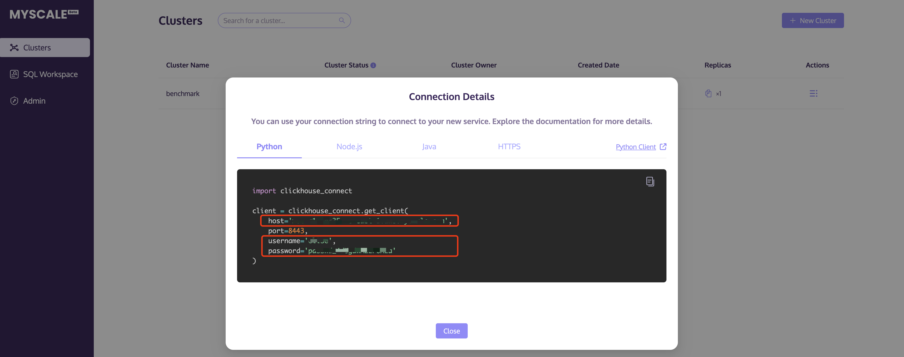
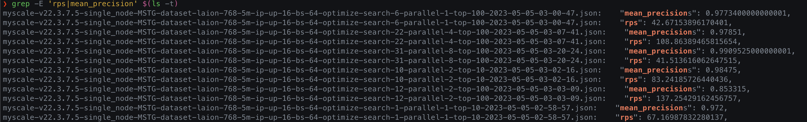
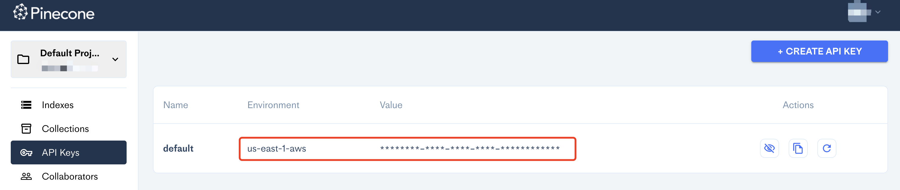
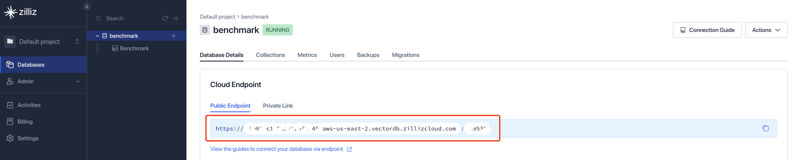
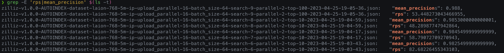
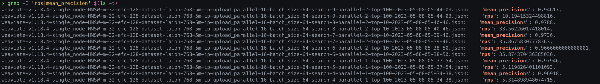
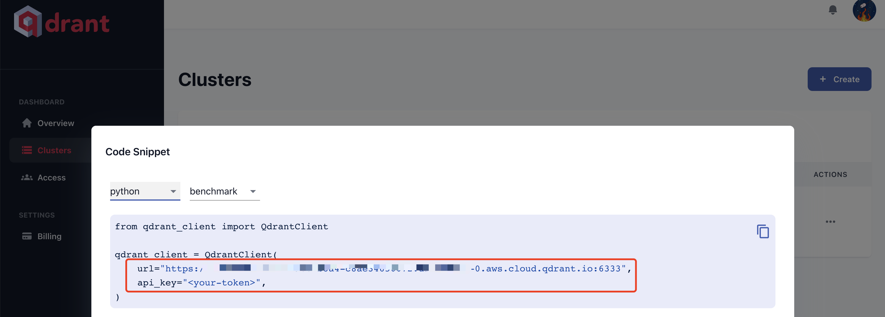
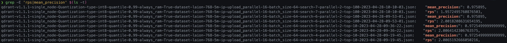
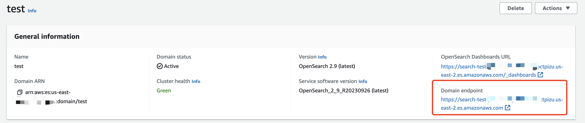
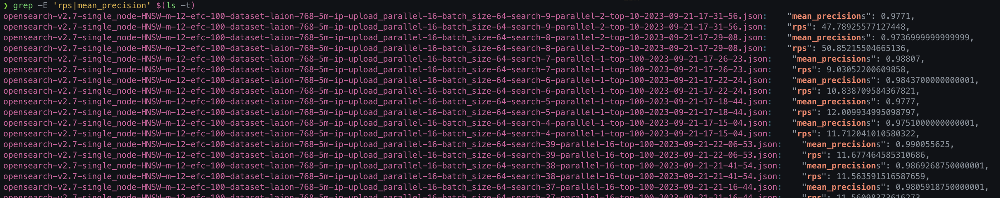

# Step-by-Step Guide for Benchmark

- [Step-by-Step Guide for Benchmark](#step-by-step-guide-for-benchmark)
  - [MyScale](#myscale)
    - [Step 1. Create Cluster](#step-1-create-cluster)
    - [Step 2. Modify the configuration](#step-2-modify-the-configuration)
    - [Step 3. Run the tests](#step-3-run-the-tests)
    - [Step 4. View the test results](#step-4-view-the-test-results)
  - [Pinecone](#pinecone)
    - [Step 1. Create Cluster](#step-1-create-cluster-1)
    - [Step 2. Modify the configuration](#step-2-modify-the-configuration-1)
    - [Step 3. Run the tests](#step-3-run-the-tests-1)
    - [Step 4. View the test results](#step-4-view-the-test-results-1)
  - [Zilliz](#zilliz)
    - [Step 1. Create Cluster](#step-1-create-cluster-2)
    - [Step 2. Modify the configuration](#step-2-modify-the-configuration-2)
    - [Step 3. Run the tests](#step-3-run-the-tests-2)
    - [Step 4. View the test results](#step-4-view-the-test-results-2)
  - [Weaviate Cloud](#weaviate-cloud)
    - [Step 1. Create Cluster](#step-1-create-cluster-3)
    - [Step 2. Modify the configuration](#step-2-modify-the-configuration-3)
    - [Step 3. Run the tests](#step-3-run-the-tests-3)
    - [Step 4. View the test results](#step-4-view-the-test-results-3)
  - [Qdrant](#qdrant)
    - [Step 1. Create Cluster](#step-1-create-cluster-4)
    - [Step 2. Modify the configuration](#step-2-modify-the-configuration-4)
    - [Step 3. Run the tests](#step-3-run-the-tests-4)
    - [Step 4. View the test results](#step-4-view-the-test-results-4)
  - [OpenSearch](#opensearch)
    - [Step 1. Create Cluster](#step-1-create-cluster-5)
    - [Step 2. Modify the configuration](#step-2-modify-the-configuration-5)
    - [Step 3. Run the tests](#step-3-run-the-tests-5)
    - [Step 4. View the test results](#step-4-view-the-test-results-5)

For any cloud vector database, the testing process follows the flowchart below:


Below are the specific testing processes for each cloud vector database.

## MyScale

### Step 1. Create Cluster

Go to the [MyScale official website](https://myscale.com/) and create a cluster.  In the [cluster console](https://console.myscale.com/clusters), record the cluster connection information: `host`, `port`, `username`, and `password`.



### Step 2. Modify the configuration

We have provided two configuration files for testing MyScale:

- [myscale_cloud_mstg_laion-768-5m-ip.json](../experiments/needs_editing/myscale_cloud_mstg_laion-768-5m-ip.json)
- [myscale_cloud_mstg_arxiv-titles-384-angular.json](../experiments/needs_editing/myscale_cloud_mstg_arxiv-titles-384-angular.json)

You need to write the cluster connection information obtained in Step 1 into the configuration files.  To modify the configuration files for testing, open each file and locate the `connection_params` section.  Update the values for `host`, `port`, `user`, and `password` with the appropriate cluster connection information obtained in Step 1. Finally, move the modified configuration file into the `experiments/configurations` directory.
Here is an example of how the modified section may look:

```shell
"connection_params": {
  "host": "your_host.aws.dev.myscale.cloud",
  "port": 8443,
  "http_type": "http",
  "user": "your_username",
  "password": "your_password"
},
```

### Step 3. Run the tests

```shell
python3 run.py --engines *myscale*
```

### Step 4. View the test results

```shell
cd results
grep -E 'rps|mean_precision' $(ls -t)
```



## Pinecone

### Step 1. Create Cluster

Register with [Pinecone](https://docs.pinecone.io/docs/overview) and obtain the cluster connection information for
`Environment` and `Value`.


### Step 2. Modify the configuration

We have provided two configuration files for testing Pinecone:

- [pinecone_cloud_s1_laion-768-5m-ip.json](../experiments/needs_editing/pinecone_cloud_s1_laion-768-5m-ip.json)
- [pinecone_cloud_s1_arxiv-titles-384-angular.json](../experiments/needs_editing/pinecone_cloud_s1_arxiv-titles-384-angular.json)

You need to write the cluster connection information obtained in Step 1 into the configuration files. Modify the `connection_params` section of the files and update the values for `environment` and `api_key`. Finally, move the modified configuration file into the `experiments/configurations` directory. Here is an example of how the modified section may look:

```shell
"connection_params": {
  "api-key": "your_api_key",
  "environment": "your_environment"
},
```

### Step 3. Run the tests

```shell
python3 run.py --engines *pinecone*
```

### Step 4. View the test results

```shell
cd results
grep -E 'rps|mean_precision' $(ls -t)
```


## Zilliz

### Step 1. Create Cluster

You need to find the cluster connection information, including `end_point`, `user`, and `password`,
in the [Zilliz Cloud console](https://cloud.zilliz.com/projects/MA==/databases).
The `user` and `password` are the credentials you specified when creating the cluster.


### Step 2. Modify the configuration

We have provided two configuration files for testing Zilliz:

- [zilliz_cloud_1cu_storage_optimized_laion-768-5m-ip.json](../experiments/needs_editing/zilliz_cloud_1cu_storage_optimized_laion-768-5m-ip.json)
- [zilliz_cloud_1cu_storage_optimized_arxiv-titles-384-angular.json](../experiments/needs_editing/zilliz_cloud_1cu_storage_optimized_arxiv-titles-384-angular.json)

You need to write the cluster connection information obtained in Step 1 into the configuration files.
To modify the configuration files for testing, open each file and locate the `connection_params` section.
Update the values for `end_point`, `cloud_user`, and `cloud_password` with the appropriate cluster connection information obtained in Step 1.
Finally, move the modified configuration file into the `experiments/configurations` directory.

Here is an example of how the modified section may look:

```shell
"connection_params": {
  "cloud_mode": true,
  "host": "127.0.0.1",
  "port": 19530,
  "user": "",
  "password": "",
  "end_point": "https://your_host.zillizcloud.com:19538",
  "cloud_user": "your_user",
  "cloud_password": "your_password",
  "cloud_secure": true
},
```

### Step 3. Run the tests

```shell
python3 run.py --engines *zilliz*
```

### Step 4. View the test results

```shell
cd results
grep -E 'rps|mean_precision' $(ls -t)
```



## Weaviate Cloud

### Step 1. Create Cluster

Register with [Weaviate Cloud](https://console.weaviate.cloud/dashboard) and create a cluster.
Record the cluster connection information: `cluster URL` and `Authentication`.


### Step 2. Modify the configuration

We have provided two configuration files for testing Weaviate Cloud:

- [weaviate_cloud_standard_laion-768-5m-ip.json](../experiments/needs_editing/weaviate_cloud_standard_laion-768-5m-ip.json)
- [weaviate_cloud_standard_arxiv-titles-384-angular.json](../experiments/needs_editing/weaviate_cloud_standard_arxiv-titles-384-angular.json)

You need to write the cluster connection information obtained in Step 1 into the configuration files.
Modify the `connection_params` section of the files and update the values for `host` and `api_key`.
The `host` corresponds to the `cluster URL`, and the `api_key` is the `Authentication`.
Finally, move the modified configuration file into the `experiments/configurations` directory.

Here is an example of how the modified section may look:

```shell
"connection_params": {
  "host": "https://your_host.weaviate.cloud",
  "port": 8090,
  "timeout_config": 2000,
  "api_key": "your_api_key"
},
```

### Step 3. Run the tests

```shell
python3 run.py --engines *weaviate*
```

### Step 4. View the test results

```shell
cd results
grep -E 'rps|mean_precision' $(ls -t)
```



## Qdrant

### Step 1. Create Cluster

Register with [Qdrant Cloud](https://cloud.qdrant.io/) and create a cluster.
Record the cluster connection information: `URL` and `API key`.


### Step 2. Modify the configuration

We have provided three configuration files for testing Qdrant:

- [qdrant_cloud_hnsw_2c16g_storage_optimized_laion-768-5m-ip.json](../experiments/needs_editing/qdrant_cloud_hnsw_2c16g_storage_optimized_laion-768-5m-ip.json)
- [qdrant_cloud_quantization_2c16g_storage_optimized_laion-768-5m-ip.json](../experiments/needs_editing/qdrant_cloud_quantization_2c16g_storage_optimized_laion-768-5m-ip.json)
- [qdrant_cloud_hnsw_2c16g_storage_optimized_arxiv-titles-384-angular.json](../experiments/needs_editing/qdrant_cloud_hnsw_2c16g_storage_optimized_arxiv-titles-384-angular.json)

You need to write the cluster connection information obtained in Step 1 into the configuration files.
Modify the `connection_params` section of the files and update the values for `host` and `api_key`.
Please note that for the `connection_params` section, you need to remove the `port` from the end of the `host` string.
Finally, move the modified configuration file into the `experiments/configurations` directory.
Here is an example of how the modified section may look:

```shell
"connection_params": {
  "host": "https://your_host.aws.cloud.qdrant.io",
  "port": 6333,
  "grpc_port": 6334,
  "prefer_grpc": false,
  "api_key": "your_api_key"
},
```

### Step 3. Run the tests

```shell
python3 run.py --engines *qdrant*
```

### Step 4. View the test results

```shell
cd results
grep -E 'rps|mean_precision' $(ls -t)
```



## OpenSearch

### Step 1. Create Cluster

Create an [OpenSearch domain](https://us-east-2.console.aws.amazon.com/aos/home?region=us-east-2#opensearch/domains) in your AWS console.
When filling in the Fine-Grained Access Control information, select "Set IAM ARN as Master User" for the Master User and enter your ARN information.
Record the cluster domain endpoint (without `https://`).


### Step 2. Modify the configuration

We have provided two configuration files for testing Qdrant:

- [opensearch_hnsw_laion-768-5m-ip.json](../experiments/needs_editing/opensearch_hnsw_laion-768-5m-ip.json)
- [opensearch_hnsw_laion-768-5m-probability-ip.json](../experiments/needs_editing/opensearch_hnsw_laion-768-5m-probability-ip.json)

You need to write the cluster connection information obtained in Step 1 into the configuration files.
Modify the `connection_params` section of the files and update the values for `host`, `aws_access_key_id` and `aws_secret_access_key`.
Finally, move the modified configuration file into the `experiments/configurations` directory.
Here is an example of how the modified section may look:

```shell
"connection_params": {
  "host": "your opensearch cluster domain endpoint",
  "port": 443,
  "user": "elastic",
  "password": "passwd",
  "aws_access_key_id": "your aws access key id",
  "aws_secret_access_key": "your aws secret access key",
  "region": "us-east-2",
  "service": "es"
},
```

### Step 3. Run the tests

```shell
python3 run.py --engines *opensearch*
```

### Step 4. View the test results

```shell
cd results
grep -E 'rps|mean_precision' $(ls -t)
```

